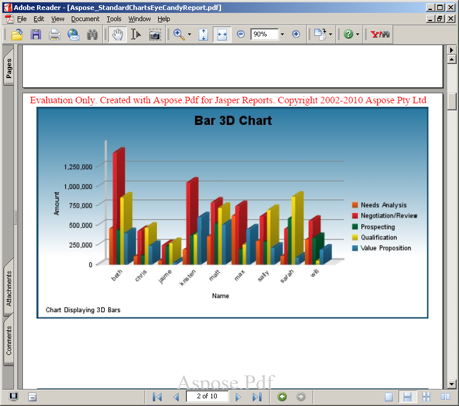
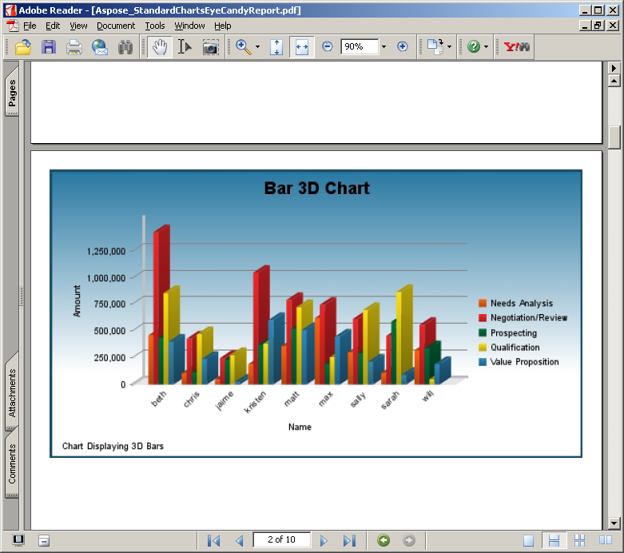

#### <ins>**Set the licenseFile Exporter Parameter in applicationContext.xml**
{}

This method is used with JasperServer.

{}

1. Download the license to your computer and copy it to the ```<InstallDir>\apache-tomcat\webapps\jasperserver\WEB-INF``` folder, where  ```<InstallDir>``` stands for the JasperServer installation directory.
2. Locate the ```<InstallDir>\apache-tomcat\webapps\jasperserver\WEB-INF\applicationContext.xml``` file and add the following lines:

```
 <bean id="AsposeExportParameters" class="comcom.aspose.pdf.jr3_7_0.jasperreports.JrPdfExportParametersBean">
    <property name="licenseFile" value="C:/jasperserver-pro-3.7.1/apache-tomcat/webapps/jasperserver-pro/WEB-  
    INF/Aspose.Total.JasperReports.lic"/>
</bean>
```
{}
Note: Please note that installation path should not contain any spaces, for example C:/Program Files/JasperServer… as that causes problems when accessing the license file.
{}

#### **Verify that License Works**
Export any report to PDF format and check if the report contains an evaluation message. If there is no evaluation message, then the license is working properly.

**Aspose.PDF for JasperReports injects a watermark when working in evaluation mode**




**Aspose.PDF for JasperReports injects a watermark when working in evaluation mode**


