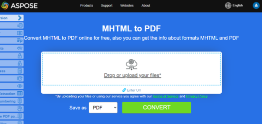

## Overview

This article explains how to convert HTML to PDF using Java. The code is very simple, just load HTML to Document class and save it as output PDF. Converting MHTML to PDF in Java is also similar. It covers the following topics

- [Java HTML to PDF](#convert-html-to-pdf)
- [Java MHTML to PDF](#convert-mhtml-to-pdf)
- [Java Convert HTML to PDF](#convert-html-to-pdf)
- [Java Convert MHTML to PDF](#convert-mhtml-to-pdf)
- [Java PDF from HTML](#convert-html-to-pdf)
- [Java PDF from MHTML](#convert-mhtml-to-pdf)
- [Java HTML to PDF Converter - How to Convert WebPage to PDF](#convert-html-to-pdf)
- [Java HTML to PDF Library, API or Code to Render, Save, Generate or Create PDF Programmatically from HTML](#convert-html-to-pdf)

## Java HTML to PDF Converter Library

**Aspose.PDF for Java** is a PDF manipulation API that lets you convert any existing HTML documents to PDF seamlessly.
The process of converting HTML to PDF can be flexibly customized.

## Convert HTML to PDF

The following Java code sample shows how to convert an HTML document to a PDF.

1. Create an instance of the [HtmlLoadOptions](https://reference.aspose.com/pdf/java/com.aspose.pdf/HtmlLoadOptions) class.
1. Initialize [Document](https://reference.aspose.com/page/java/com.aspose.page/document) object.
1. Save output PDF document by calling **Document.save(String)** method.

```java
// Create HTML load options
HtmlLoadOptions htmloptions = new HtmlLoadOptions(); 		

// Load HTML file
Document doc = new Document("Sample.html", htmloptions); 

// Convert HTML file to PDF
doc.save("HTMLtoPDF.pdf");
```

{}
**Try to convert HTML to PDF online**

Aspose presents you online free application ["HTML to PDF"](https://products.aspose.app/html/en/conversion/html-to-pdf), where you may try to investigate the functionality and quality it works.

[](https://products.aspose.app/html/en/conversion/html-to-pdf)
{}

## How to convert HTML file to PDF Simple variant:

1. Create a HTML [HtmlLoadOptions](https://reference.aspose.com/pdf/java/com.aspose.pdf/HtmlLoadOptions).
1. Initialize [Document object](<https://reference.aspose.com/page/java/com.aspose.page/document>).
1. Save output PDF document.

```java
 private static void ConvertHTMLtoPDF_Simple() {
        // Create a HTML LoadOptions
        HtmlLoadOptions options = new HtmlLoadOptions();

        // Initialize document object
        String htmlFileName = Paths.get(_dataDir.toString(), "test.html").toString();
        Document document = new Document(htmlFileName, options);

        // Save output PDF document
        document.save(Paths.get(_dataDir.toString(), "HTMLtoPDF.pdf").toString());
    }
```

## Advanced conversion from HTML to PDF

The HTML Conversion engine has several options that allow us to control the conversion process.

### Media Queries Support

1. Create a HTML [LoadOptions](https://reference.aspose.com/pdf/java/com.aspose.pdf/HtmlLoadOptions).
1. Set Print or Screen mode. 
1. Initialize [Document object](<https://reference.aspose.com/page/java/com.aspose.page/document>).
1. Save output PDF document. 

Media queries are a popular technique for delivering a tailored style sheet to different devices. We can set device type using [HtmlMediaType](https://reference.aspose.com/pdf/java/com.aspose.pdf/HtmlMediaType) property.

```java
  private static void ConvertHTMLtoPDFAdvanced_MediaType() {
        // Create a HTML LoadOptions
        HtmlLoadOptions options = new HtmlLoadOptions();

        // Set Print or Screen mode
        options.setHtmlMediaType(HtmlMediaType.Print);

        // Initialize document object
        String htmlFileName = Paths.get(_dataDir.toString(), "test.html").toString();
        Document document = new Document(htmlFileName, options);

        // Save output PDF document
        document.save(Paths.get(_dataDir.toString(), "HTMLtoPDF.pdf").toString());
    }
```

### Enable (disable) font embedding

1. Add new Html [LoadOptions](https://reference.aspose.com/pdf/java/com.aspose.pdf/HtmlLoadOptions).
1. Disable font embedding.
1. Save a new Document.

HTML pages often use fonts (i.g. fonts from local folder, Google Fonts, etc). We can also control the embedding of fonts in a document using a [IsEmbedFonts](https://reference.aspose.com/pdf/java/com.aspose.pdf/HtmlLoadOptions#isEmbedFonts--) property.

```java
public static void ConvertHTMLtoPDFAdvanced_EmbedFonts() {

        HtmlLoadOptions options = new HtmlLoadOptions();
        // Disable font embedding
        options.setEmbedFonts(true);

        Document document = new Document(_dataDir + "test_fonts.html", options);
        document.save(_dataDir + "html_test.PDF");
    }
```

### Manage external resource loading

The Conversion Engine provides a mechanism that allows you to control the loading of certain resources associated with the HTML document.
The [HtmlLoadOptions](https://reference.aspose.com/pdf/java/com.aspose.pdf/HtmlLoadOptions) class has the property [CustomLoaderOfExternalResources](https://reference.aspose.com/pdf/java/com.aspose.pdf/HtmlLoadOptions#setCustomLoaderOfExternalResources-com.aspose.pdf.LoadOptions.ResourceLoadingStrategy-) with which we can define the behavior of the resource loader.

```java
    public static void ConvertHTMLtoPDFAdvanced_DummyImage() {
        HtmlLoadOptions options = new HtmlLoadOptions();
        options.CustomLoaderOfExternalResources = new LoadOptions.ResourceLoadingStrategy() {
            public LoadOptions.ResourceLoadingResult invoke(String resourceURI) {
                // Creating clear template resource for replacing:
                LoadOptions.ResourceLoadingResult res = new LoadOptions.ResourceLoadingResult(new byte[] {});
                // Return empty byte array in case i.imgur.com server
                if (resourceURI.contains("i.imgur.com")) {
                    return res;
                } else {
                    // Process resources with default resource loader
                    res.LoadingCancelled = true;
                    return res;
                }
            }
        };

        Document pdfDocument = new Document(_dataDir + "test.html", options);
        pdfDocument.save(_dataDir + "html_test.PDF");
    }
```

## Convert MHTML to PDF

{}
**Try to convert MHTML to PDF online**

Aspose.PDF for Java presents you online free application ["MHTML to PDF"](https://products.aspose.app/pdf/conversion/mhtml-to-pdf), where you may try to investigate the functionality and quality it works.

[](https://products.aspose.app/pdf/conversion/mhtml-to-pdf)
{}

<abbr title="MIME encapsulation of aggregate HTML documents">MHTML</abbr>, short for MIME HTML, is a web page archive format used to combine resources that are typically represented by external links (such as images, Flash animations, Java applets, and audio files) with HTML code into a single file. The content of an MHTML file is encoded as if it were an HTML email message, using the MIME type multipart/related.

Next code snippet show how to covert MHTML files to PDF format with Java:

```java
public final class ConvertMHTMLtoPDF {

    private ConvertMHTMLtoPDF() {
    }

    private static Path _dataDir = Paths.get("/home/aspose/pdf-examples/Samples");

    public static void main(String[] args) throws FileNotFoundException {
        
        // Instantiate MHTML Load option object
        MhtLoadOptions options = new MhtLoadOptions();
        
        // Create Document object
        String mhtmlFileName = Paths.get(_dataDir.toString(), "samplefile.mhtml").toString();
        Document document = new Document(mhtmlFileName, options);

        // Save output PDF document
        document.save(Paths.get(_dataDir.toString(),"TEXtoPDF.pdf").toString());
    }
}
```
