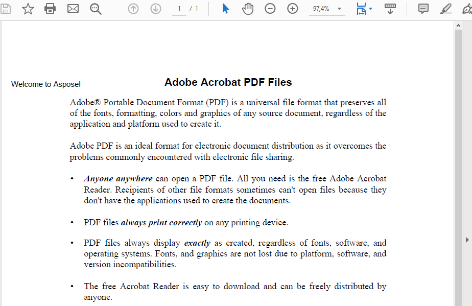
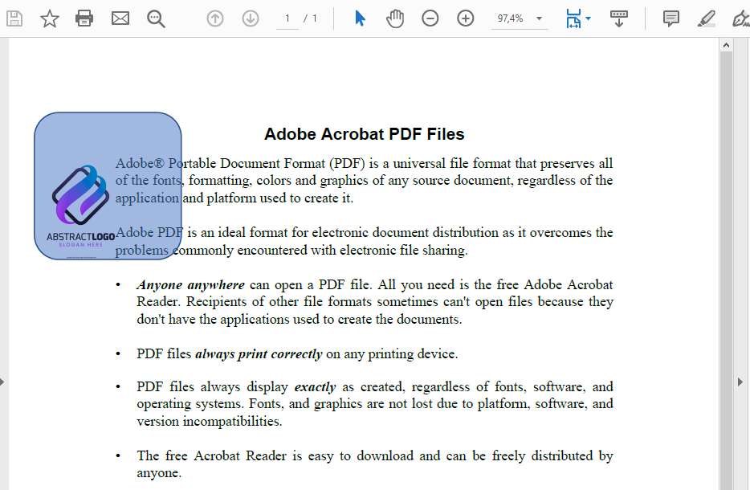

It would seem not a difficult task to insert [FormattedText](https://apireference.aspose.com/pdf/java/com.aspose.pdf.facades/classes/FormattedText) into PDF document, provided that you have the original editable version of this document. Suppose you created a document, and then remembered that you need to add another line or we are talking about bigger volume of documents, in both cases it will help you Aspose.PDF Facades. Let's consider the possibility of adding text in an existing PDF File with [PdfFileMend](https://apireference.aspose.com/pdf/java/com.aspose.pdf.facades/PdfFileMend) class.

## Add Text in an Existing PDF File (facades)

We can add text in several ways. Consider the first. We take the [FormattedText](https://apireference.aspose.com/pdf/java/com.aspose.pdf.facades/classes/FormattedText) and add it to the Page. After, we indicate the coordinates of the lower left corner, and then we add our text to the Page.

```java
    public static void AddText01()
    {
        PdfFileMend mender = new PdfFileMend();
        mender.BindPdf(_dataDir + "sample.pdf");
        FormattedText message = new FormattedText("Welcome to Aspose!");

        mender.AddText(message, 1, 10, 750);

        // save the output file
        mender.Save(_dataDir + "PdfFileMend01_output.pdf");
    }
```

Check how it's looks:



The second way to add [FormattedText](https://apireference.aspose.com/pdf/java/com.aspose.pdf.facades/formattedtext). Additionally, we indicate a rectangle in which our text should fit.

```java
public static void AddText02()
    {
        PdfFileMend mender = new PdfFileMend();
        mender.BindPdf(_dataDir + "sample.pdf");
        FormattedText message = new FormattedText("Welcome to Aspose! Welcome to Aspose!");

        mender.AddText(message, 1, 10, 700, 55, 810);
        mender.WrapMode = WordWrapMode.ByWords;

        // save the output file
        mender.Save(_dataDir + "PdfFileMend02_output.pdf");
    }
```

The third example provides the ability to Add Text to specified pages. In our example, let's add a caption on pages 1 and 3 of the document.

```java
public static void AddText03()
    {
        Document document = new Document(_dataDir + "sample.pdf");
        document.Pages.Add();
        document.Pages.Add();
        document.Pages.Add();
        PdfFileMend mender = new PdfFileMend();
        mender.BindPdf(document);
        FormattedText message = new FormattedText("Welcome to Aspose!");
        int[] pageNums = new int[] { 1, 3 };
        mender.AddText(message, pageNums, 10, 750, 310, 760);

        // save the output file
        mender.Save(_dataDir + "PdfFileMend03_output.pdf");
    }
```

## Add Image in an Existing PDF File (facades)

Have you ever tried to add an image to an existing PDF file? We are sure you know that this is not an easy task. Perhaps you are filling out a form online and you need to attach a photo for identification or attach your photo to an existing resume. Previously, such a task was solved by creating a photo, attaching it to a document, further scanning and sending. This process was a lot of hassle and time consuming.

Adding images and text in an existing PDF file is a common requirement and com.aspose.pdf.facades namespace fulfills this requirement very well. It provides a class [PdfFileMend](https://apireference.aspose.com/pdf/java/com.aspose.pdf.facades/PdfFileMend) which allows you to add images in the PDF file.

This article will show you how to insert an image into a PDF using com.aspose.pdf.facades. There are also several options for adding images to PDF.

Insert image into the PDF document by setting the parameters of the rectangle.

```java
public static void AddImage01()
    {
        Document document = new Document(_dataDir + "sample.pdf");
        PdfFileMend mender = new PdfFileMend();

        // Load image into stream
        var imageStream = System.IO.File.OpenRead(_dataDir + "logo.png");
        mender.BindPdf(document);
        mender.AddImage(imageStream, 1, 10, 650, 110, 750);

        // save the output file
        mender.Save(_dataDir + "PdfFileMend04_output.pdf");
    }
```


Let's consider the second code snippet. By using variations of the [CompositingParameters](https://apireference.aspose.com/pdf/java/com.aspose.pdf/CompositingParameters) class parameters, we can get different design effects.
We tried one of them.

```java
 public static void AddImage02()
    {
        Document document = new Document(_dataDir + "sample_color.pdf");
        PdfFileMend mender = new PdfFileMend();
        // Load image into stream
        var imageStream = System.IO.File.OpenRead(_dataDir + "logo.png");
        mender.BindPdf(document);
        int pageNum = 1;
        int lowerLeftX = 10;
        int lowerLeftY = 650;
        int upperRightX = 110;
        int upperRightY = 750;
        CompositingParameters compositingParameters = new CompositingParameters(BlendMode.Multiply);
        mender.AddImage(imageStream, pageNum, lowerLeftX, lowerLeftY, upperRightX, upperRightY, compositingParameters);

        // save the output file
        mender.Save(_dataDir + "PdfFileMend05_output.pdf");
    }
```



In the following code snippet we use [ImageFilterType](https://apireference.aspose.com/pdf/java/com.aspose.pdf/ImageFilterType). ImageFilterType indicates the type of stream codec that will be used for encoding, by default Jpeg. if you load an image from PNG format, then it will be saved in the document as JPEG (or in another format I have specified).

```java
    public static void AddImage03()
    {
        Document document = new Document(_dataDir + "sample_color.pdf");
        PdfFileMend mender = new PdfFileMend();
        // Load image into stream
        var imageStream = System.IO.File.OpenRead(_dataDir + "logo.png");
        mender.BindPdf(document);
        int pageNum = 1;
        int lowerLeftX = 10;
        int lowerLeftY = 650;
        int upperRightX = 110;
        int upperRightY = 750;
        CompositingParameters compositingParameters = new CompositingParameters(BlendMode.Exclusion, ImageFilterType.Flate);
        mender.AddImage(imageStream, pageNum, lowerLeftX, lowerLeftY, upperRightX, upperRightY, compositingParameters);

        // save the output file
        mender.Save(_dataDir + "PdfFileMend06_output.pdf");
    }
```

In the next code snippet you can note the use of the [IsMasked](https://apireference.aspose.com/pdf/java/com.aspose.pdf/CompositingParameters#isMasked--) method.

[IsMasked](https://apireference.aspose.com/pdf/java/com.aspose.pdf/CompositingParameters#isMasked--) is a flag, which indicates whether to apply a mask to the image in order to achieve transparency of the original image

```java
public static void AddImage04()
{
    Document document = new Document(_dataDir + "sample_color.pdf");
    PdfFileMend mender = new PdfFileMend();
    // Load image into stream
    var imageStream = System.IO.File.OpenRead(_dataDir + "logo.png");
    mender.BindPdf(document);
    int pageNum = 1;
    int lowerLeftX = 10;
    int lowerLeftY = 650;
    int upperRightX = 110;
    int upperRightY = 750;
    CompositingParameters compositingParameters = new CompositingParameters(BlendMode.Multiply, ImageFilterType.Flate,false);
    mender.AddImage(imageStream, pageNum, lowerLeftX, lowerLeftY, upperRightX, upperRightY, compositingParameters);

    // save the output file
    mender.Save(_dataDir + "PdfFileMend07_output.pdf");
}
```
