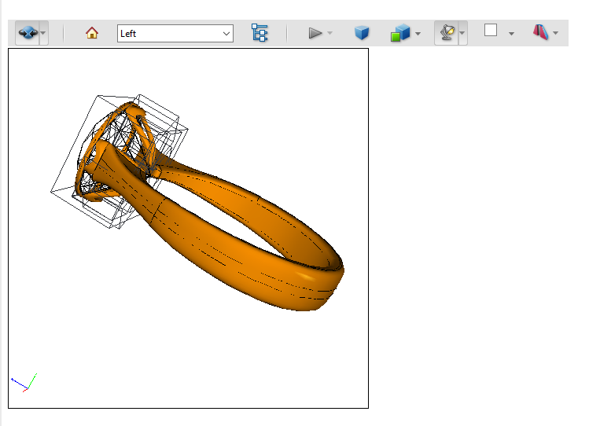

In PDF documents, you can view and manage high-quality 3D content created with 3D CAD or 3D modeling software and embedded in the PDF document. Can rotate 3D elements in all directions as if you were holding them in your hands.

Why do you need a 3D display of images at all?

Over the past few years, tech has made huge breakthroughs in all areas thanks to 3D printing. 3D printing technologies can be applied to teach technological skills in construction, mechanical engineering, design as the main tool. These technologies thanks to the emergence of personal printing devices can contribute to the introduction of new forms of organization of the educational process, increase motivation, and formation of the necessary competencies of graduates
and teachers.

The main task of 3D modeling is the idea of a future object or object because, in order to release an object, you need an understanding of its design features in all detail for successive regeneration in industrial design or architecture.

## Add 3D Annotation

3D annotation is added using a model created in the u3d format.

1. Create a new [Document](https://apireference.aspose.com/pdf/net/aspose.pdf/document)
1. Create [PDF3DContent](https://apireference.aspose.com/pdf/net/aspose.pdf.annotations/pdf3dcontent), load the data of the required 3D model "Ring.u3d"
1. Next, set three parameters: the page on which the annotation will be placed; the rectangle, inside which the annotation, and the [3dArtWork](https://apireference.aspose.com/pdf/net/aspose.pdf.annotations/pdf3dartwork) object.
1. Select the parameters of pdf3dArtWork:

- PDF 3DLightingScheme - CAD
- PDF 3DRenderMode - Solid

1. Set the display parameters of PDF 3DView (at least one): Top, Left
1. For a better display of the 3D object, set the Border frame
1. Set the parameter of the initial display at boot (for example - TOP)
1. Additional model parameter - name
1. Add Annotation to the [Page](https://apireference.aspose.com/pdf/net/aspose.pdf/page)
1. Save the result

Please check the following code snippet to add 3D Annotation.

```csharp
 public static void Add3dAnnotation()
    {
    // Load the PDF file
    Document document = new Document();
    PDF3DContent pdf3DContent = new PDF3DContent(System.IO.Path.Combine(_dataDir,"Ring.u3d"));
    PDF3DArtwork pdf3dArtWork = new PDF3DArtwork(document, pdf3DContent)
    {
        LightingScheme = new PDF3DLightingScheme(LightingSchemeType.CAD),
        RenderMode = new PDF3DRenderMode(RenderModeType.Solid),
    };
    var topMatrix = new Matrix3D(1,0,0,0,-1,0,0,0,-1,0.10271,0.08184,0.273836);
    var frontMatrix = new Matrix3D(0, -1, 0, 0, 0, 1, -1, 0, 0, 0.332652, 0.08184, 0.085273);
    pdf3dArtWork.ViewArray.Add(new PDF3DView(document, topMatrix, 0.188563, "Top")); //1
    pdf3dArtWork.ViewArray.Add(new PDF3DView(document, frontMatrix, 0.188563, "Left")); //2

    var page = document.Pages.Add();

    var pdf3dAnnotation = new PDF3DAnnotation(page, new Rectangle(100, 500, 300, 700), pdf3dArtWork);
    pdf3dAnnotation.Border = new Border(pdf3dAnnotation);
    pdf3dAnnotation.SetDefaultViewIndex(1);
    pdf3dAnnotation.Flags = AnnotationFlags.NoZoom;
    //pdf3dAnnotation.Contents = "Ring.u3d";
    pdf3dAnnotation.Name = "Ring.u3d";
    //pdf3dAnnotation.SetImagePreview(System.IO.Path.Combine(_dataDir, "sample_3d.png"));
    document.Pages[1].Annotations.Add(pdf3dAnnotation);

    document.Save(System.IO.Path.Combine(_dataDir, "sample_3d.pdf"));
```

This code example showed us such a model:

