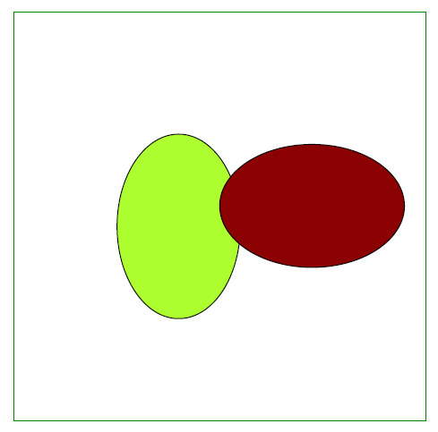
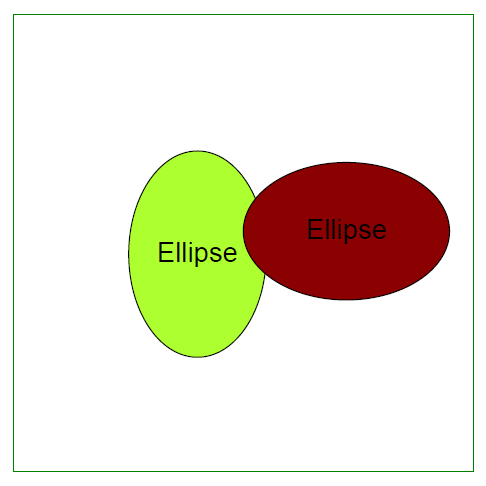

Aspose.PDF for .NET supports to add [Ellipse](https://apireference.aspose.com/pdf/net/aspose.pdf.drawing/ellipse) objects to PDF documents. It also offers the feature to fill ellipse  object with a certain color.

```csharp
 public static void Ellipse()
        {
            // Create Document instance
            var document = new Document();

            // Add page to pages collection of PDF file
            var page = document.Pages.Add();

            // Create Drawing object with certain dimensions
            var graph = new Aspose.Pdf.Drawing.Graph(400, 400);

            // Set border for Drawing object
            var borderInfo = new BorderInfo(BorderSide.All, Color.Green);
            graph.Border = borderInfo;

            var ellipse1 = new Ellipse(150, 100, 120, 60);
            ellipse1.GraphInfo.Color = Color.GreenYellow;
            ellipse1.Text = new TextFragment("Ellipse");
            graph.Shapes.Add(ellipse1);

            var ellipse2 = new Ellipse(50, 50, 18, 300);
            ellipse2.GraphInfo.Color = Color.DarkRed;

            graph.Shapes.Add(ellipse2);

            // Add Graph object to paragraphs collection of page
            page.Paragraphs.Add(graph);

            // Save PDF file
            document.Save(_dataDir + "DrawingEllipse_out.pdf");

        }
```


## Create Filled Ellipse Object

The following code snippet shows how to add a [Ellipse](https://apireference.aspose.com/pdf/net/aspose.pdf.drawing/ellipse)  object that is filled with color.

```csharp
     public static void EllipseFilled()
        {
            // Create Document instance
            var document = new Document();

            // Add page to pages collection of PDF file
            var page = document.Pages.Add();

            // Create Drawing object with certain dimensions
            var graph = new Aspose.Pdf.Drawing.Graph(400, 400);

            // Set border for Drawing object
            var borderInfo = new BorderInfo(BorderSide.All, Color.Green);
            graph.Border = borderInfo;

            var ellipse1 = new Ellipse(100, 100, 120, 180);
            ellipse1.GraphInfo.FillColor = Color.GreenYellow;
            graph.Shapes.Add(ellipse1);

            var ellipse2 = new Ellipse(200, 150, 180, 120);
            ellipse2.GraphInfo.FillColor = Color.DarkRed;
            graph.Shapes.Add(ellipse2);

            // Add Graph object to paragraphs collection of page
            page.Paragraphs.Add(graph);

            // Save PDF file
            document.Save(_dataDir + "DrawingEllipse_out.pdf");
        }
```



## Add Text inside the Ellipse

Aspose.PDF for .NET supports to add text inside the Graph Object. Text property of Graph Object provides option to set text of the Graph Object. The following code snippet shows how to add text inside a Rectangle object.

```csharp
        public static void EllipseWithText()
        {
            // Create Document instance
            var document = new Document();

            // Add page to pages collection of PDF file
            var page = document.Pages.Add();

            // Create Drawing object with certain dimensions
            var graph = new Aspose.Pdf.Drawing.Graph(400, 400);
            // Set border for Drawing object
            var borderInfo = new BorderInfo(BorderSide.All, Color.Green);
            graph.Border = borderInfo;

            var textFragment = new TextFragment("Ellipse");
            textFragment.TextState.Font = FontRepository.FindFont("Helvetica");
            textFragment.TextState.FontSize = 24;

            var ellipse1 = new Ellipse(100, 100, 120, 180);
            ellipse1.GraphInfo.FillColor = Color.GreenYellow;
            ellipse1.Text = textFragment;
            graph.Shapes.Add(ellipse1);


            var ellipse2 = new Ellipse(200, 150, 180, 120);
            ellipse2.GraphInfo.FillColor = Color.DarkRed;
            ellipse2.Text = textFragment;
            graph.Shapes.Add(ellipse2);

            // Add Graph object to paragraphs collection of page
            page.Paragraphs.Add(graph);

            // Save PDF file
            document.Save(_dataDir + "DrawingEllipseText_out.pdf");

        }
 ```


