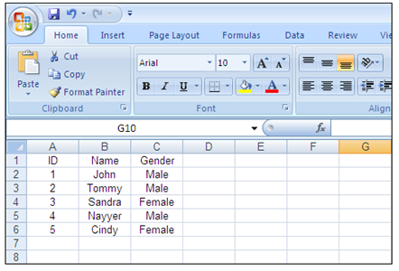
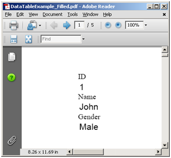
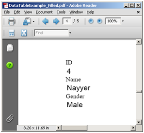

{}

[Aspose.Pdf.Facades namespace](https://apireference.aspose.com/pdf/net/aspose.pdf.facades) in [Aspose.PDF for .NET](/pdf/net/) offers various ways to fill the Pdf forms. You can import data from XML file, DFD, XFDF, use API and even can use the data from Excel worksheet.
We would be using **ExportDataTable** method of [Cells](http://www.aspose.com/api/net/pdf/aspose.pdf/cells) class of [Aspose.Cells](https://docs.aspose.com//cells/net) to export the data from Excel sheet in to DataTable object. Then we need would be importing this data into Pdf form using **ImportDataTable** method of [AutoFiller](http://www.aspose.com/api/net/pdf/aspose.pdf.facades/autofiller) class. Make sure that, the Column name of DataTable is same as field name over PDF form.

{}

## Implementation Details

In the following scenario we are going to using a PDF form, which contains three form fields named ID, Name and Gender.


In the Form specified above has one page, with three fields named as "ID", "Name" and "Gender" consequently. We would be extracting the data from the following excel sheet into DataTable object.



We need to create an object of [AutoFiller](http://www.aspose.com/api/net/pdf/aspose.pdf.facades/autofiller) class and bind the Pdf form present in the above pictures and use the **ImportDataTable** method to fill the form fields using the data present in DataTable object.
Once the method is called a new Pdf form file is generated, which contains five pages with form filled based over the data from Excel sheet. Input Pdf form was single page and resultant is five pages, because the number of data rows in excel sheet is 5. The DataTable class offers the capability to use the first row of the sheet as ColumnName.

|****|****|
| :- | :- |
|||

```csharp
Workbook workbook = new Workbook();
// Creating a file stream containing the Excel file to be opened
FileStream fstream = new FileStream("d:\\pdftest\\newBook1.xls", FileMode.Open);
// Opening the Excel file through the file stream
workbook.Open(fstream);
// Accessing the first worksheet in the Excel file
Worksheet worksheet = workbook.Worksheets[0];
// Exporting the contents of 7 rows and 2 columns starting from 1st cell to DataTable
DataTable dataTable = worksheet.Cells.ExportDataTable(0, 0, worksheet.Cells.MaxRow + 1, worksheet.Cells.MaxColumn + 1, true);
// Closing the file stream to free all resources
fstream.Close();
// Create an object of AutoFiller class
AutoFiller autoFiller = new AutoFiller();
// The input pdf file that contains form fields
autoFiller.InputFileName = "d:\\pdftest\\DataTableExample.pdf";
// The resultant pdf, that will contain the form fields filled with information from DataTable
autoFiller.OutputFileName = "D:\\pdftest\\DataTableExample_Filled.pdf";
// Call the method to import the data from DataTable object into Pdf form fields.
autoFiller.ImportDataTable(dataTable);
// Call the save method to generate the pdf file
autoFiller.Save();
```

For information on how to export worksheet data please visit Exporting Data from Worksheets
For information on filling form fields using please visit  AutoFiller.

## Conclusion

{}
[Aspose.PDF.Facades](https://apireference.aspose.com/pdf/net/aspose.pdf.facades) also offers the capability to fill PDF form using data from database but this feature is currently supported in .Net version.
{}
