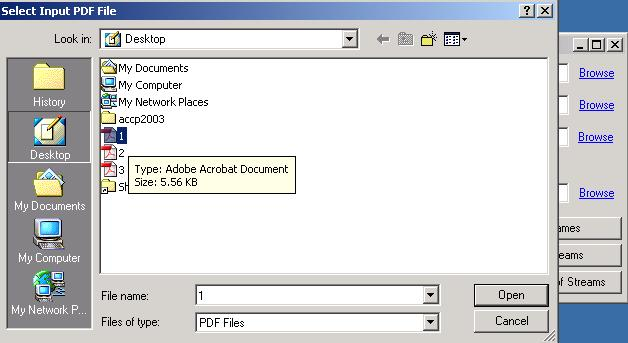
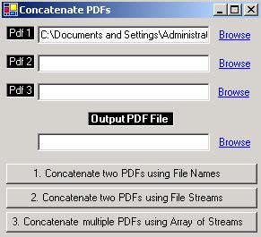
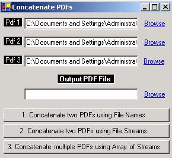
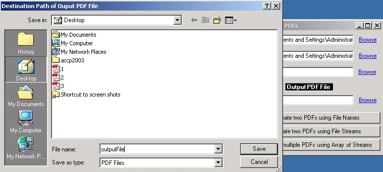
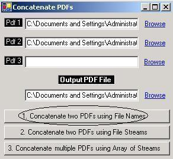
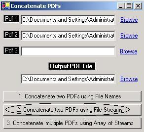
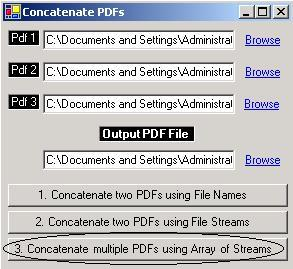

{} 

This articles describes that how you can [Concatenate](http://www.aspose.com/api/net/pdf/aspose.pdf.facades/pdffileeditor/methods/concatenate/index) multiple PDF Documents into a Single PDF Document with the help of [Aspose.PDF for .NET](/pdf/net/home-html/) Component. [Aspose.PDF for .NET](/pdf/net/home-html/) makes this job like a piece of cake.

{} 

## Details

All you have to do is to call [Concatenate](http://www.aspose.com/api/net/pdf/aspose.pdf.facades/pdffileeditor/methods/concatenate/index) method of [PdfFileEditor](http://www.aspose.com/api/net/pdf/aspose.pdf.facades/pdffileeditor) class and all of your input PDF files will be concatenated together and a single PDF file will be generated. Let's create an application to practice the concatenation of PDF files. We will create an application using Visual Studio.NET 2003.

Aspose.PDF for .NET can be used in any kind of application running on .NET Framework either it is an ASP.NET web application or a Windows Application

A windows form application's view is shown below for the demonstration of the [PdfFileEditor](http://www.aspose.com/api/net/pdf/aspose.pdf.facades/pdffileeditor) class for the Concatenation of PDF Files. 

! How to Concatenate PDF Files in Different Ways-001.png|border=1!

In the form above, there are three Text Boxes (textBox1, textBox2, textBox3) having their respective Link Labels (linkLabel1, linkLabel2, linkLabel3) for browsing the PDF files. By clicking "Browse" Link Label, an Input File Dialog (inputFileDialog1) will appear that will enable us to choose the PDF files (to be concatenated).



 private void linkLabel1_LinkClicked(object sender, System.Windows.Forms.LinkLabelLinkClickedEventArgs e)

{

  if(openFileDialog1.ShowDialog()==DialogResult.OK)

  {

     textBox1.Text=openFileDialog1.FileName;

  }

}



After we choose the PDF file and click OK button. The complete file name with path is assigned to the related Text Box. 

Similarly, we can choose two or three Input PDF Files to concatenate as shown below: 

The last Text Box (textBox4) will take the Destination Path of the Output PDF file with its name where this output file will be created. 

## Concatenate() Method

Concatenate() method can be used in three ways:

### Approach 1

- Concatenate(string firstInputFile, string secInputFile, string outputFile)

This approach is good only if you need to join only two PDF files. First two arguments (firstInputFile and secInputFile) provide the complete file names with their storage path of the two input PDF files that are to be concatenated. Third argument (outputFile) provides the desired file name with path of the output PDF file. 



 private void button2_Click(object sender, System.EventArgs e)

{

  PdfFileEditor pdfEditor = new PdfFileEditor();

  pdfEditor.Concatenate(textBox1.Text,textBox2.Text,textBox4.Text);

}



### Approach 2

- Concatenate(System.IO.Stream firstInputStream, System.IO.Stream secInputStream, System.IO.Stream outputStream)

Similar to the above approach, this approach also allows joining two PDF files. First two arguments (firstInputStream and secInputStream) provide the two input PDF files as Streams (a stream is an array of bits/bytes) that are to be concatenated. Third argument (outputStream) provides the stream representation of desired output PDF file. 



 private void button3_Click(object sender, System.EventArgs e)

{

  FileStream pdf1 = new FileStream(textBox1.Text,FileMode.Open);

  FileStream pdf2 = new FileStream(textBox2.Text,FileMode.Open);

  FileStream outputPDF = new FileStream(textBox4.Text,FileMode.Create);

  PdfFileEditor pdfEditor = new PdfFileEditor();

  pdfEditor.Concatenate(pdf1,pdf2,outputPDF);

  outputPDF.Close();

}



### Approach 3

- Concatenate(System.IO.Stream inputStreams[], System.IO.Stream outputStream)

If you want to join more than two PDF files then this approach would be your ultimate choice. First argument (inputStreams[]) provides the input PDF files in the form of an Array of Streams that are to be concatenated. Second argument (outputStream) provides the stream representation of desired output PDF file. 



 private void button1_Click(object sender, System.EventArgs e)

{

  FileStream pdf1 = new FileStream(textBox1.Text,FileMode.Open);

  FileStream pdf2 = new FileStream(textBox2.Text,FileMode.Open);

  FileStream pdf3 = new FileStream(textBox3.Text,FileMode.Open);

  Stream[] pdfStreams = new Stream[]{pdf1,pdf2,pdf3};

  FileStream outputPDF = new FileStream(textBox4.Text,FileMode.Create);

  PdfFileEditor pdfEditor = new PdfFileEditor();

  pdfEditor.Concatenate(pdfStreams,outputPDF);

  outputPDF.Close();

}



Conclusion

{} 

This article explains possible ways to concatenate any number of existing PDF files into a Single PDF file.

{}
