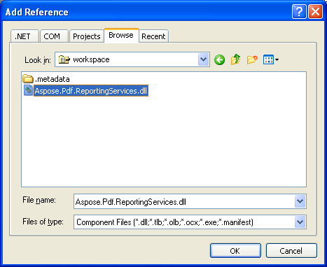
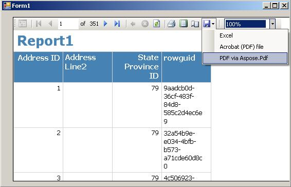

{}

Microsoft Report Viewer is a powerful .NET control allowing the use of RDL and RDLC reports in WinForms and ASP.NET applications. It enables users to view and export reports to different formats. The control is included with Microsoft Visual Studio 2005 and 2008, and is also available as a free download from Microsoft.

{}

Report Viewer can generate reports independently using a built-in engine (**local mode**), or it can display reports that are generated on a Microsoft SQL Server Reporting Services Report Server (**remote mode**).
When working in the **remote mode**, Report Viewer can export reports to all formats installed on the Report Server to which it is connected. Therefore, to export reports to PDF format you only need to install Aspose.PDF for Reporting Services on the server.

When working in the **local mode** however, Report Viewer does not connect to a Report Server and the list of export formats is limited to only a few built-in formats.

By installing Aspose.PDF for Reporting Services on a development machine and following the steps below, you will be able to add the ability to export to PDF format from Report Viewer working in the **local mode**.

**Step 1. Add a Reference to Aspose.Pdf.ReportingServices.dll to your project.**

Open your project in Visual Studio, right click on the **References** folder and select **Add Reference**. Click the **Browse** tab and browse to the following assembly:

If using Microsoft Report Viewer 2005 **-** browse to *<InstallDir>/Bin/ReportViewer2005/Aspose.Pdf.ReportingServices.dll*

If using Microsoft Report Viewer 2008 - browse *<InstallDir>/Bin/ReportViewer2008/Aspose.Pdf.ReportingServices.dll*

Where *<InstallDir>* is the directory, where you installed or unpacked Aspose.Pdf for Reporting Services.
##### **Adding a Reference to Aspose.PDF.ReportingServices.dll to your project.**

**Step 2. Copy and paste the following AddExtension method into your project.**
This method adds the specified rendering extension to the list of supported extensions in Microsoft Report Viewer using private reflection.

**C#**



 using System.Collections;

using System.Reflection;

using Microsoft.ReportingServices.ReportRendering;

// Use one of the two namespaces below depending on whether you are developing

// a WinForms or WebForms application.

using Microsoft.Reporting.WinForms;

// -- or --

// using Microsoft.Reporting.WebForms;

/// 

/// Adds the specified rendering extension to the specified ReportViewer instance.

/// 

/// <param name="viewer">A ReportViewer control instance.</param>

/// <param name="name">The name of the export format.</param>

/// <param name="localizedName">The localized name of the export format that appears on the dropdown list.</param>

/// <param name="extensionType">The class of the rendering extension to add.</param>

private static void AddExtension(ReportViewer viewer, string name, string localizedName, Type extensionType)

{

    const BindingFlags flags = BindingFlags.NonPublic | BindingFlags.Public | BindingFlags.Instance;

    // CommonService.ListRenderingExtension is an internal method that returns a list of supported

    // rendering extensions. This list is also stored in a class field so we can simply get this list

    // and add Aspose.PDF for Reporting Services rendering extensions to make Pdf export formats

    // appear on the dropdown.

    // Get the service type.

    FieldInfo previewService = viewer.LocalReport.GetType().GetField("m_previewService", flags);

    // Get the ListRenderingExtensions method info.

    MethodInfo listRenderingExtensions = previewService.FieldType.GetMethod("ListRenderingExtensions", flags);

    // Obtan a list of existing rendering extensions.

    IList extensions = listRenderingExtensions.Invoke(previewService.GetValue(viewer.LocalReport), null) as IList;

    // LocalRenderingExtensionInfo is a class that holds information about a rendering extension.

    // We should create an instance of this class to add the info about the specified extension.

    // Since the IRenderingExtension interface is defined in the Microsoft.ReportViewer.Common

    // assembly, use this trick to obtain the corresponding Assembly instance. This will work for

    // both Report Viewer 2005 (8.0) and 2008 (9.0).

    Assembly commonAssembly = typeof(IRenderingExtension).Assembly;

    // Now, get the LocalRenderingExtensionInfo type as it is defined in the same assembly.

    Type localRenderingExtensionInfoType = commonAssembly.GetType("Microsoft.Reporting.LocalRenderingExtensionInfo");

    // Get the LocalRenderingExtensionInfo constructor info.

    ConstructorInfo ctor = localRenderingExtensionInfoType.GetConstructor(

        flags,

        null,

        new Type[] { typeof(string), typeof(string), typeof(bool), typeof(Type), typeof(bool) },

        null);

    // Create an instance of LocalRenderingExtensionInfo.

    object instance = ctor.Invoke(new object[] { name, localizedName, true, extensionType, true });

    // Finally, add the info about our rendering extension to the list.

    extensions.Add(instance);

}



**Step 3. Invoke the AddExtension method from your code.**
You can call `AddExtension` (shown in the previous step) whenever you need to add Aspose.Pdf for Reporting Services export formats to a Report Viewer control instance. Consider calling from the **Form_Load** or **Page_Load** event handler of a WinForms or ASP .NET application. Note calling the **ReportViewer.Reset** method will reset export formats to initial state, so if you need to use this method in your application, you have to add new export format each times after the method is invoked.You can add the Aspose.Pdf for Reporting Services export format. You can specify any display name for the format to appear in Report Viewer.

To add Aspose.PDF for Reporting Services export format to Microsoft Report Viewer in local mode, use the following code:

**C#**



 AddExtension(reportViewer1, "APPDF", "PDF via Aspose.PDF",

typeof(Aspose.PDF.ReportingServices.Renderer));



**Step 4. Test the new export formats.**Run your application and you should notice the Aspose.PDF for Reporting Services export format available in the Export dropdown list in Report Viewer. Select it and run export. Verify the PDF document is created the way you expected.
##### **New export format appear in Report Viewer running in local mode.**

