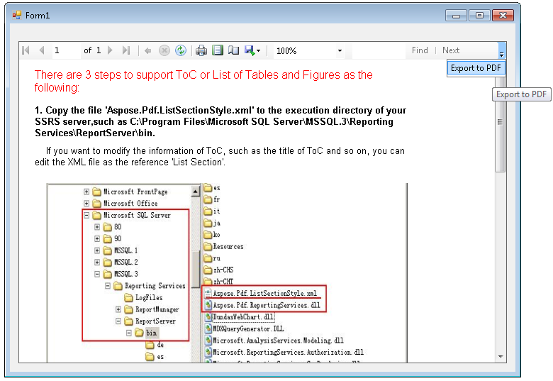

{}

This page demonstrates how to export report from ReportViewer 2010 or ReportViewer 2012 to PDF format using Aspose.PDF for Reporting Services.

{}
{}
RplRenderer class renders [Report Page Layout (RPL) Binary Stream Format](http://msdn.microsoft.com/en-us/library/ee301773.aspx) to PDF format. Whereas RplRenderer internally uses [soft page breaks](http://msdn.microsoft.com/en-us/library/dd255244.aspx) to control page size while using InteractiveHeight and InteractiveWidth RDL tags.
{}
The following code shows how to export report from ReportViewer 2010 to PDF format using using RplRenderer. Execute RenderToPpt method to render current report to PDF.

**C#**



 using System.IO;

using System.Reflection;

using System.Collections;

using Microsoft.ReportingServices.ReportRendering;

// Use one of the two namespaces below depending on whether you are developing

// a WinForms or WebForms application.

using Microsoft.Reporting.WinForms;

namespace AsposeTest

{

    class PdfExportHelper

    {

        /// 

        /// Renders current report to PDF

        /// 

        /// <param name="reportViewer">The report viewer object.</param>

        /// <param name="format">The output presentation format.</param>

        /// <param name="filename">The output filename.</param>

        public static void RenderWithAsposePdf(ReportViewer reportViewer, string filename)

        {

            //Enable Export to RPL feature

            EnableRplRenderExtension(reportViewer);

            //create file for our PDF

            using (FileStream pptSteam = new FileStream(filename, FileMode.Create))

            {

                Aspose.PDF.ReportingServices.RplRenderer renderer = new Aspose.PDF.ReportingServices.RplRenderer();

                //start rendering process

                //here we are choosing to export in PDF format and providing outputStream

                renderer.StartRendering();

                int page = 1;

                //this cycle iterates through all pages of report

                while (true)

                {

                    using (MemoryStream rplStream = CreateRplStream(reportViewer, page))

                    {

                        //if rplStream is empty then we reached end of report

                        if (rplStream.Length == 0)

                            break;

                        //add report page to the document

                        renderer.RenderPage(rplStream);

                    }

                    page++;

                }

                //call finish method to flush our newly created PDF to output stream

                renderer.FinishRendering(pptSteam);

            }

        }

            /// 

        /// Enables the RPL rendering extension.

        /// Be careful because this method alters internal state of ReportViewer class instance

        /// and there is no guarantee that this method will work with future version of ReportViewer

        /// 

        /// <param name="reportViewer">The report viewer.</param>

        public  static void EnableRplRenderExtension(ReportViewer reportViewer)

        {

            var service = reportViewer.LocalReport

                   .GetType()

                   .GetField("m_previewService",

                    BindingFlags.NonPublic | BindingFlags.Instance)

                   .GetValue(reportViewer.LocalReport);

            var extensions = service

                .GetType()

                .GetMethod("ListRenderingExtensions")

                .Invoke(service, null);

            IList RenderingExtensions = (IList)extensions;

            bool rplExportEnabled = false;

            foreach (var extension in RenderingExtensions)

            {

                var name = extension

                    .GetType()

                    .GetProperty("Name")

                    .GetValue(extension, null)

                    .ToString();

                if (name == "RPL")

                {

                    extension

                        .GetType()

                        .GetField("m_isVisible",

                    BindingFlags.NonPublic | BindingFlags.Instance)

                        .SetValue(extension, true);

                    extension

                        .GetType()

                        .GetField("m_isExposedExternally",

                    BindingFlags.NonPublic | BindingFlags.Instance)

                        .SetValue(extension, true);

                    rplExportEnabled = true;

                }

            }

            if (!rplExportEnabled)

                throw new System.Exception("Can't enable RPL export. Please, make sure that you are using ReportViewer 2010.");

        }

        /// 

        /// Renders specific page to RPL

        /// 

        /// <param name="reportViewer">The report viewer.</param>

        /// <param name="page">The page.</param>

        static MemoryStream CreateRplStream(ReportViewer reportViewer, int page)

        {

            Warning[] warnings;

            var stream = new MemoryStream();

            reportViewer.LocalReport.Render("RPL",System.String.Format(@"<DeviceInfo><StartPage>{0}</StartPage><EndPage>{0}</EndPage><SecondaryStreams>Embedded</SecondaryStreams></DeviceInfo>", page),

                                                    (CreateStreamCallback)delegate { return stream; },

                                                    out warnings);

            return stream;

        }

    }

}



Optionally you may consider adding export buttons to TollStripPanel of ReportViewer by adding next code to Form's constructor:

**C#**



 System.Windows.Forms.ToolStrip toolStrip = (System.Windows.Forms.ToolStrip)reportViewer1.Controls.Find("toolStrip1", true)[0];

// add the button with specific caption

System.Windows.Forms.ToolStripItem exportButton = toolStrip.Items.Add("Export to PDF");

exportButton.Click += new System.EventHandler((s, e) =>

{

    PdfExportHelper.RenderWithAsposePdf(this.reportViewer1, "Output.pdf");

});



**WinForm showing Export to PDF button**
#### **Integration with ReportViewer 2012**
In order to support ReportViewer 2012, please try using following code snippet for integration

**C#**



 class PdfExportHelper

    {

        /// 

        /// Renders current report to PDF
        /// 

        /// <param name="reportViewer">The report viewer object.</param>
        /// <param name="format">The output presentation format.</param>
        /// <param name="filename">The output filename.</param>
        public static void RenderWithAsposePdf(ReportViewer reportViewer, string filename)
        {
            //Enable Export to RPL feature
            EnableRplRenderExtension(reportViewer);
            //create file for our PDF
            using (FileStream pptSteam = new FileStream(filename, FileMode.Create))
            {
                Aspose.PDF.ReportingServices.RplRenderer renderer = new Aspose.PDF.ReportingServices.RplRenderer();
                //start rendering process
                //here we are choosing to export in PDF format and providing outputStream
                renderer.StartRendering();
                int page = 1;
                //this cycle iterates through all pages of report
                while (true)
                {
                    using (MemoryStream rplStream = CreateRplStream(reportViewer, page))
                    {
                        //if rplStream is empty then we reached end of report
                        if (rplStream.Length == 0)
                            break;
                        //add report page to the document
                        renderer.RenderPage(rplStream);
                    }
                    page++;
                }
                //call finish method to flush our newly created PDF to output stream
                renderer.FinishRendering(pptSteam);
            }
        }
        /// 

        /// Enables the RPL rendering extension.
        /// Be careful because this method alters internal state of ReportViewer class instance
        /// and there is no guarantee that this method will work with future version of ReportViewer
        /// 

        /// <param name="reportViewer">The report viewer.</param>
        public static void EnableRplRenderExtension(ReportViewer reportViewer)
        {
            object service = null;
            if (reportViewer.ProductVersion.StartsWith("11"))
                service = reportViewer.LocalReport.GetType().GetField("m_processingHost", BindingFlags.NonPublic | BindingFlags.Instance).GetValue(reportViewer.LocalReport);
            else
                service = reportViewer.LocalReport.GetType().GetField("m_previewService", BindingFlags.NonPublic | BindingFlags.Instance).GetValue(reportViewer.LocalReport);

            var extensions = service
                .GetType()
                .GetMethod("ListRenderingExtensions")
                .Invoke(service, null);
            IList RenderingExtensions = (IList)extensions;
            bool rplExportEnabled = false;
            foreach (var extension in RenderingExtensions)
            {
                var name = extension
                    .GetType()
                    .GetProperty("Name")
                    .GetValue(extension, null)
                    .ToString();
                if (name == "RPL")
                {                  
                    extension.GetType().GetField("m_isExposedExternally", BindingFlags.NonPublic | BindingFlags.Instance).SetValue(extension, true);
                    rplExportEnabled = true;
                    break;
                }
            }
            if (!rplExportEnabled)
                throw new Exception("Can't enable RPL export. Please, make sure that you are using ReportViewer 2010 or 2012.");
        }
        /// 

        /// Renders specific page to RPL
        /// 

        /// <param name="reportViewer">The report viewer.</param>
        /// <param name="page">The page.</param>
        static MemoryStream CreateRplStream(ReportViewer reportViewer, int page)
        {
            Warning[] warnings;
            var stream = new MemoryStream();
            reportViewer.LocalReport.Render("RPL", System.String.Format(@"<DeviceInfo><StartPage>{0}</StartPage><EndPage>{0}</EndPage><SecondaryStreams>Embedded</SecondaryStreams></DeviceInfo>", page),
                                                    (CreateStreamCallback)delegate { return stream; },

                                                    out warnings);
            return stream;
        }
}


