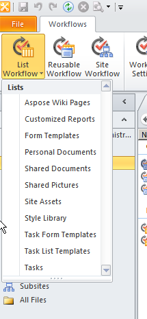
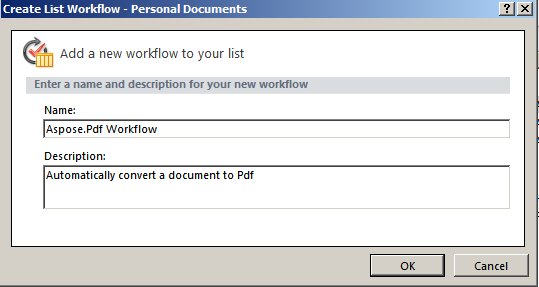
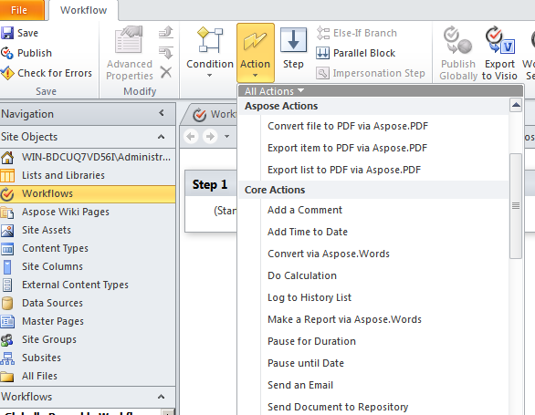
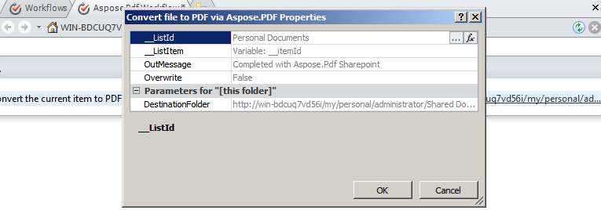
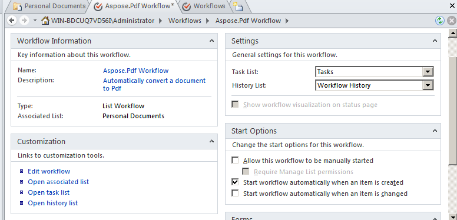
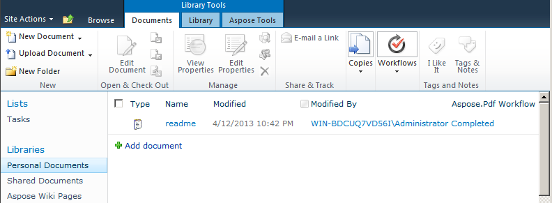

{}

Support for workflows is key functionality of Microsoft Office SharePoint Server. Workflows help automate movement of documents according to business logic and streamline the cost and time of document organization. This article demonstrates how to use Aspose.PDF for SharePoint in a workflow that converts a document to PDF.

{}
### **Setting up a Workflow**

{}

This example creates a workflow that converts any new item in a document library to PDF format and stores it in another document library. The example users the **Personal Documents** library as the source library and the **Pdf** sub-folder in the **Shared Documents** library as the destination library.

Aspose.PDF for SharePoint supports conversion of HTML, text and image files.
#### **Design the Workflow using SharePoint Designer**
1. Open **SharePoint Designer** and connect to the site where the workflow will be implemented.
1. Select **Workflows** from **site objects** and then open **List Workflow**.
1. Select the **Personal Documents** library to create and attach a new list workflow to the document library.

   **Selecting Personal Documents from the menu**

1. Create and attach the list workflow to the **Personal Documents** library by typing a workflow name and description.
1. Click **OK** to complete this step.

   **Creating a list workflow**

A workflow step editor appears. This is used to define conditions and actions for workflows. Now add an action to convert a new document to PDF without any condition, from **Aspose Actions**.

1. Select the **Convert file to PDF via Aspose.PDF** action from the **Action** menu.

   **Selecting and action**

1. Configure the action parameters:
   1. Set **this folder** parameter to the destination folder.
   1. Either leave the other action parameters as default values or set using the action properties window. The default value for the **Overwrite** parameter is false.

      **The Workflow Editor**

**Setting the destination library**

**Setting the properties**

1. From the **Workflow** menu, select **Workflow Settings**.
1. Select **start workflow automatically when a new item created** and clear other options from **Start Options**.

   **Setting the start options**

The workflow design is finished.

1. Save and publish the workflow to implement it on the SharePoint site.
#### **Test the Workflow**
To test the workflow:

1. Open the SharePoint site and upload a new document to the **Personal Documents** document library.
   Aspose.PDF for SharePoint supports conversion from HTML files, text files, and images (JPG, PNG, GIF, TIFF and BMP*) to PDF. The workflow is configured to start automatically when a new item is created, so files are process automatically.
1. Refresh the browser.
   The workflow status appear in the workflow column, **Aspose.PDF Workflow** in this case.

   **Adding a document to the source library**

1. Open the destination document library to view the converted document. **Shared Documents/Pdf** is the path in this example.

   **The destination library**

{}
